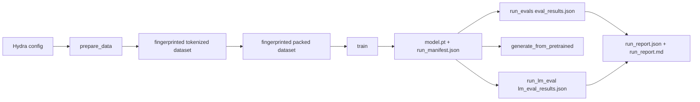

# ScaleTraining

ScaleTraining is a single-GPU language-model training harness for dense and Mixture-of-Experts decoder-only transformers. It is a personal ML systems project focused on the infrastructure around training: configuration, preprocessing artifacts, token-budgeted training, checkpointing, evaluation, and reproducible run metadata.

The repo is intentionally reviewable without a GPU. The default verification path runs unit tests and an offline CPU end-to-end smoke over a tiny local text fixture, then proves the same artifact contract used for larger runs.

## What This Demonstrates

- Hydra-based experiment configuration with small overrideable config groups.
- Explicit data preparation before training, with fingerprinted tokenized and packed artifacts.
- Decoder-only transformer implementation with RoPE, tied embeddings, dense FFNs, and optional MoE blocks.
- Token-budgeted training loop with gradient accumulation, learning-rate scheduling, validation hooks, W&B logging, and checkpoint manifests.
- MoE routing metrics for entropy, load balance, expert usage, top-k gates, and auxiliary loss.
- Checkpoint loading for validation perplexity, generation, and lm-evaluation-harness benchmarks, with JSON eval sidecars.
- Run evidence bundles that combine training, checkpoint, validation, and benchmark artifacts.
- CPU-safe tests and CI checks for config loading, public entrypoints, model contracts, and optimizer smoke coverage.

## Reviewer Entry Points

- [docs/architecture.md](docs/architecture.md): reviewer-facing architecture and engineering claims.
- [docs/reviewer-demo.md](docs/reviewer-demo.md): non-heavy commands to inspect the package and tests.
- [notes/architecture.md](notes/architecture.md): deeper internal design notes and cleanup plan.

## Quick Verification

These commands do not train a model or require a GPU.

```bash
uv run pytest -q
uv run python -m compileall -q src scripts tests
uv run python -m scaletraining.entrypoints.train --help
uv run python -m scaletraining.entrypoints.prepare_data --help
uv run python -m scaletraining.entrypoints.run_evals --help
uv run python -m scaletraining.entrypoints.run_lm_eval --help
```

To exercise the full artifact path on CPU without network access:

```bash
uv run python scripts/smoke_cpu_e2e.py
```

The smoke command creates a temporary run directory, prepares local fixture data, trains a tiny model, evaluates validation perplexity, builds a run report, and verifies the expected sidecar artifacts.

Slow optimizer convergence coverage is intentionally excluded from the default test run. To inspect it:

```bash
uv run pytest --collect-only -q -m slow
```

## Pipeline



## Reviewer Path

Use this path when inspecting the repository without GPU access or external dataset downloads:

```bash
uv run pytest -q
uv run python -m compileall -q src scripts tests
uv run python scripts/smoke_cpu_e2e.py
```

The smoke run verifies that `prepare_data`, `train`, `run_evals`, and `run_report` work together on CPU and produce `run_manifest.json`, `train_result.json`, `eval_results.json`, `run_report.json`, and `run_report.md`.

## Training Path

Training requires preprocessed artifacts. Run data prep first, then train, then evaluate or generate from a checkpoint.

```bash
# 1. Prepare tokenized and packed data
uv run python -m scaletraining.entrypoints.prepare_data

# 2. Train until the configured token budget
uv run python -m scaletraining.entrypoints.train

# 3. Evaluate validation perplexity from a checkpoint
uv run python -m scaletraining.entrypoints.run_evals

# 4. Generate from a checkpoint
uv run python -m scaletraining.entrypoints.generate_from_pretrained

# 5. Run lm-evaluation-harness tasks
LM_EVAL_TASKS=hellaswag uv run python -m scaletraining.entrypoints.run_lm_eval

# 6. Build a reviewer-facing evidence bundle
uv run python scripts/run_report.py --run-dir outputs/<run>
```

Training and evaluation fail fast when expected tokenized, packed, or checkpoint artifacts are missing. This is deliberate: artifacts are part of the reproducibility contract.

## Tiny Smoke Config

The repository includes tiny CPU-oriented profiles for debugging config composition and local smoke runs:

```bash
uv run python scripts/run_plan.py --model-size tiny --token-budget 4096 --target-loss 8.0 -o device=cpu -o training=smoke
```

When you are ready to run a short training job, use the command emitted by `scripts/run_plan.py`. The planner records the intended model size, token budget, success criterion, estimated parameters, estimated FLOPs, artifact paths, and the exact prepare/train/eval commands.

## Run Planning For Results

Use `scripts/run_plan.py` before an experiment to produce a small run contract:

```bash
uv run python scripts/run_plan.py \
  --model-size small \
  --token-budget 10000000 \
  --target-loss 4.5 \
  -o eval.tasks=hellaswag
```

The report includes:

- model dimensions and parameter count,
- token budget and effective batch size,
- target loss or success criterion,
- dataset fingerprint and expected artifact directories,
- estimated training FLOPs,
- exact commands for data prep, training, validation perplexity, and lm-eval.

After a run, the canonical evidence bundle is:

- `outputs/<run>/run_manifest.json`: config, dataset fingerprint, and checkpoint metadata.
- `outputs/<run>/train_result.json`: final training result copied into the run directory.
- `outputs/<run>/eval_results.json`: validation loss, perplexity, evaluated tokens, and batches.
- `outputs/<run>/lm_eval_results.json`: lm-eval tasks and result payload when benchmarks are run.
- `outputs/<run>/run_report.json` and `outputs/<run>/run_report.md`: machine-readable and reviewer-readable summaries.

## Wrap-Up Evidence

The final project artifact should be a small checked-in summary of several completed runs, not raw checkpoints. The intended format is a Markdown table in this README backed by compact JSON/Markdown reports with:

- run id and command summary,
- dataset fingerprint and token budget,
- model shape and optimizer,
- final train loss,
- validation loss/perplexity,
- benchmark results when available,
- notes about hardware and runtime.

Raw `outputs/` directories and model weights stay ignored. Only compact evidence summaries should be committed.

## Configuration

Key config groups live under `conf/`:

- `device`: CPU/CUDA and attention kernel settings.
- `training`: seed, batch size, accumulation, token budget, eval cadence, DataLoader settings.
- `model`: transformer depth, width, heads, context length, RoPE, dropout.
- `moe`: optional MoE layers, experts, top-k routing, router schedules, load-balance coefficient.
- `optimizer`: Muon, AdaMuon, or AdamW settings.
- `tokenizer`: dataset selection, tokenizer choice, packing behavior.
- `logging`: W&B integration and implementation logging.
- `generation`: checkpoint path and sampling settings.
- `eval`: lm-eval task list and result artifact settings.

Hydra overrides work at the command line:

```bash
uv run python -m scaletraining.entrypoints.train model.n_layer=8 training.batch_size=8 training.max_train_tokens=1000000
```

## Entrypoints

- `prepare_data.py`: tokenizes and packs datasets offline.
- `train.py`: trains until the token budget and writes checkpoint artifacts plus `train_result.json`.
- `run_evals.py`: computes validation loss/perplexity from a checkpoint and writes `eval_results.json`.
- `generate_from_pretrained.py`: generates text from a trained checkpoint.
- `run_lm_eval.py`: runs lm-evaluation-harness tasks against a checkpoint and writes `lm_eval_results.json`.
- `scripts/run_report.py`: combines run sidecars into `run_report.json` and `run_report.md`.

## Advanced Corpus Builder

For larger streaming pretraining corpora:

```bash
uv run python scripts/build_pretraining_corpus.py --preset tiny
uv run python scripts/build_pretraining_corpus.py --preset standard --corpus mix
```

Presets:

- `tiny`: 50M tokens for iteration.
- `standard`: 1B tokens for larger runs.

This path is intentionally separate from the default prepare/train/eval flow.

## Current Scope

Implemented and tested in the quick suite:

- config schema composition,
- public entrypoint imports,
- dense and MoE model forward/backward smoke checks,
- corrected transformer residual/norm wiring,
- `moe_n_layers` block selection,
- MoE routing-stat emission,
- reproducible eval sidecars and run reports,
- configured training seed for controlled comparisons,
- offline CPU smoke path over local fixture data,
- batch packing,
- optimizer smoke behavior.

Future work is scoped in GitHub issues and pull requests when selected, keeping this README focused on implemented behavior.
