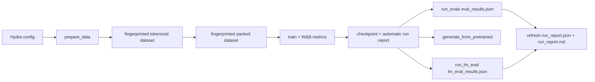

# ScaleTraining

ScaleTraining is a single-GPU language-model training harness for dense and Mixture-of-Experts decoder-only transformers. It is a personal ML systems project focused on the infrastructure around training: configuration, preprocessing artifacts, token-budgeted training, checkpointing, evaluation, and reproducible run metadata.

The repo is intentionally reviewable without a GPU. The default verification path runs unit tests and an offline CPU end-to-end smoke over a tiny local text fixture, then proves the same artifact contract used for larger runs.

## What This Demonstrates

- Hydra-based experiment configuration with small overrideable config groups.
- Explicit data preparation before training, with fingerprinted tokenized and packed artifacts.
- Decoder-only transformer implementation with RoPE, tied embeddings, dense FFNs, and optional MoE blocks.
- Token-budgeted training loop with gradient accumulation, learning-rate scheduling, validation hooks, token-indexed W&B metrics, and checkpoint manifests.
- MoE routing metrics for entropy, load balance, expert usage, top-k gates, and auxiliary loss.
- Checkpoint loading for validation perplexity, generation, and lm-evaluation-harness benchmarks, with JSON eval sidecars.
- Automatically generated run evidence bundles that link training, checkpoint, validation, benchmark, and W&B records.
- CPU-safe tests and CI checks for config loading, public entrypoints, model contracts, and optimizer smoke coverage.

## Reviewer Entry Points

- [docs/architecture.md](docs/architecture.md): reviewer-facing architecture and engineering claims.
- [docs/reviewer-demo.md](docs/reviewer-demo.md): non-heavy commands to inspect the package and tests.
- [notes/architecture.md](notes/architecture.md): deeper internal design notes and cleanup plan.

## Quick Verification

These commands do not train a model or require a GPU.

```bash
uv run pytest -q
uv run python -m compileall -q src scripts tests
uv run python -m scaletraining.entrypoints.train --help
uv run python -m scaletraining.entrypoints.prepare_data --help
uv run python -m scaletraining.entrypoints.run_evals --help
uv run python -m scaletraining.entrypoints.run_lm_eval --help
```

To exercise the full artifact path on CPU without network access:

```bash
uv run python scripts/smoke_cpu_e2e.py
```

The smoke command creates a temporary run directory, prepares local fixture data, trains a tiny model, verifies that training automatically builds a run report, evaluates validation perplexity, and verifies that evaluation refreshes the same report.

Slow optimizer convergence coverage is intentionally excluded from the default test run. To inspect it:

```bash
uv run pytest --collect-only -q -m slow
```

## Pipeline



## Reviewer Path

Use this path when inspecting the repository without GPU access or external dataset downloads:

```bash
uv run pytest -q
uv run python -m compileall -q src scripts tests
uv run python scripts/smoke_cpu_e2e.py
```

The smoke run verifies that `prepare_data`, `train`, and `run_evals` work together on CPU. Training produces `run_manifest.json`, `model.pt`, `model_config.json`, `train_result.json`, `run_report.json`, and `run_report.md`; evaluation adds `eval_results.json` and refreshes both reports automatically.

## Training Path

Training requires preprocessed artifacts. Run data prep first, then train, then evaluate or generate from a checkpoint.

```bash
# 1. Prepare tokenized and packed data
uv run python -m scaletraining.entrypoints.prepare_data

# 2. Train until the configured token budget
uv run python -m scaletraining.entrypoints.train

# 3. Evaluate validation perplexity from a checkpoint
uv run python -m scaletraining.entrypoints.run_evals

# 4. Generate from a checkpoint
uv run python -m scaletraining.entrypoints.generate_from_pretrained

# 5. Run lm-evaluation-harness tasks
LM_EVAL_TASKS=hellaswag uv run python -m scaletraining.entrypoints.run_lm_eval

# 6. Optionally refresh the automatically generated evidence bundle
uv run python scripts/run_report.py --run-dir outputs/<run>
```

Training and evaluation fail fast when expected tokenized, packed, or checkpoint artifacts are missing. This is deliberate: artifacts are part of the reproducibility contract.

## Tiny Smoke Config

The repository includes tiny CPU-oriented profiles for debugging config composition and local smoke runs:

```bash
uv run python scripts/run_plan.py --model-size tiny --token-budget 4096 --target-loss 8.0 -o device=cpu -o training=smoke
```

When you are ready to run a short training job, use the command emitted by `scripts/run_plan.py`. The planner records the intended model size, token budget, success criterion, estimated parameters, estimated FLOPs, artifact paths, and the exact prepare/train/eval commands.

## Run Planning For Results

Use `scripts/run_plan.py` before an experiment to produce a small run contract:

```bash
uv run python scripts/run_plan.py \
  --model-size small \
  --token-budget 10000000 \
  --target-loss 4.5 \
  -o eval.tasks=hellaswag
```

The report includes:

- model dimensions and parameter count,
- token budget and effective batch size,
- target loss or success criterion,
- dataset fingerprint and expected artifact directories,
- estimated training FLOPs,
- exact commands for data prep, training, validation perplexity, and lm-eval.

After a run, the canonical evidence bundle is:

- `outputs/<run>/run_manifest.json`: config, dataset fingerprint, requested and resolved device, lifecycle status, terminal progress, checkpoint provenance, and W&B run identity.
- `outputs/<run>/train_result.json`: final loss, core hyperparameters, checkpoint provenance, and terminal training progress.
- `outputs/<run>/eval_results.json`: validation loss, perplexity, evaluated tokens, and batches.
- `outputs/<run>/lm_eval_results.json`: lm-eval tasks and result payload when benchmarks are run.
- `outputs/<run>/run_report.json` and `outputs/<run>/run_report.md`: machine-readable and reviewer-readable summaries.

Training writes the initial reports automatically. Validation and lm-eval
refresh them after adding their result sidecars. `scripts/run_report.py` remains
available as an explicit rebuild command.

The run directory is allocated before W&B initialization or training starts.
Its manifest moves from `running` to `completed`, or to `failed` with the
exception type and message; failure finalization writes a partial report when
possible. The tracking record is explicit even without an online run: its state
is `initialized`, `disabled`, `unavailable`, or `initialization_failed`, with
the mode, W&B path/URL, or initialization error when available.

Terminal progress distinguishes all `tokens_processed` by forward/backward from
`tokens_applied` in completed optimizer windows. It also records optimizer
steps, the `token_budget_reached`, `early_stopping`, or `data_exhausted` stop
reason, and any tokens or microbatches left in an incomplete accumulation
window. Consequently, reaching a token budget can honestly report more
processed than applied tokens.

Checkpoint-bearing sidecars use the run-relative `model.pt` identity plus its
SHA-256 digest, while retaining the original absolute path only as provenance.
This keeps a complete run bundle verifiable after it is moved. Evaluation
validates a proposed sidecar against the manifest, checkpoint contents, and
existing evidence before atomically replacing the prior result. A custom
`eval.output_dir` must therefore be the checkpoint-owning run directory; the
default is the checkpoint's parent. Portable reports use `.` and run-relative
artifact paths, while `original_path` remains informational provenance.

W&B is the detailed time-series record. Tracking schema version 1 uses
`progress/tokens` as the common comparison axis and also records
`progress/optimizer_step`. Measurements are grouped under `train/*`,
`validation/*`, `performance/*`, `compute/*`, and `moe/*`; fixed model size is
recorded under `model/*`:

- `train/loss_per_token`, `train/learning_rate`, and
  `train/grad_norm_pre_clip` describe each completed optimizer window.
- `validation/loss_per_token` and `validation/perplexity` share the training
  token axis.
- `performance/tokens_per_second` measures only the timed accumulation compute
  window, excluding loader wait, evaluation, logging, and report generation.
- `compute/flops_total` is a cumulative estimate; peak allocated and reserved
  byte counters are emitted only for the selected CUDA device.
- `moe/l<layer>/*`, aggregate `moe/*` means, and `moe/aux_loss` expose routing
  behavior when MoE is enabled.
- `model/total_params`, `model/trainable_params`, and fp32/bf16 size estimates
  are fixed metadata in W&B history and summary.

The local bundle intentionally does not duplicate this detailed history.

## Closeout Status

The training harness is substantially complete: the quick tests, syntax
compilation, and offline CPU prepare → train → evaluate → report path validate
the software and artifact contracts. This is strong systems evidence, but it is
not yet a differentiated experimental conclusion.

Known limitations:

- Checkpoints contain model weights and model configuration, but not optimizer,
  token-progress, or RNG state. Exact interruption/resume equivalence is not
  supported.
- Historical checkpoints that lack validation and report sidecars are not
  treated as experimental evidence.
- CPU smoke runs prove wiring and reproducibility surfaces, not model quality.

The remaining closeout target is one controlled, modest experiment with fixed
fingerprints, token budgets, evaluation settings, and appropriate seeds. Keep
its detailed history in W&B, retain the compact run reports, and write down a
specific conclusion. Any follow-up tooling should directly serve that study;
do not add multi-GPU or generic platform features simply to expand the feature
list.

Raw `outputs/` directories and model weights stay ignored. Only compact,
reviewable evidence summaries should be committed.

## Configuration

Key config groups live under `conf/`:

- `device`: CPU/CUDA and attention kernel settings.
- `training`: seed, batch size, accumulation, token budget, eval cadence, DataLoader settings.
- `model`: transformer depth, width, heads, context length, RoPE, dropout.
- `moe`: optional MoE layers, experts, top-k routing, router schedules, load-balance coefficient.
- `optimizer`: Muon, AdaMuon, or AdamW settings.
- `tokenizer`: dataset selection, tokenizer choice, packing behavior.
- `logging`: W&B integration and implementation logging.
- `generation`: checkpoint path and sampling settings.
- `eval`: lm-eval task list and result artifact settings.

Hydra overrides work at the command line:

```bash
uv run python -m scaletraining.entrypoints.train model.n_layer=8 training.batch_size=8 training.max_train_tokens=1000000
```

## Entrypoints

- `prepare_data.py`: tokenizes and packs datasets offline.
- `train.py`: trains until the token budget and automatically writes the checkpoint, manifest, result, and initial run reports.
- `run_evals.py`: computes validation loss/perplexity, writes `eval_results.json`, and refreshes the run reports.
- `generate_from_pretrained.py`: generates text from a trained checkpoint.
- `run_lm_eval.py`: runs lm-evaluation-harness tasks, writes `lm_eval_results.json`, and refreshes the run reports.
- `scripts/run_report.py`: manually rebuilds `run_report.json` and `run_report.md` when needed.

## Advanced Corpus Builder

For larger streaming pretraining corpora:

```bash
uv run python scripts/build_pretraining_corpus.py --preset tiny
uv run python scripts/build_pretraining_corpus.py --preset standard --corpus mix
```

Presets:

- `tiny`: 50M tokens for iteration.
- `standard`: 1B tokens for larger runs.

This path is intentionally separate from the default prepare/train/eval flow.

## Current Scope

Implemented and tested in the quick suite:

- config schema composition,
- public entrypoint imports,
- dense and MoE model forward/backward smoke checks,
- corrected transformer residual/norm wiring,
- `moe_n_layers` block selection,
- MoE routing-stat emission,
- reproducible eval sidecars and run reports,
- configured training seed for controlled comparisons,
- offline CPU smoke path over local fixture data,
- batch packing,
- optimizer smoke behavior.

Future work is scoped in GitHub issues and pull requests when selected, keeping this README focused on implemented behavior.
