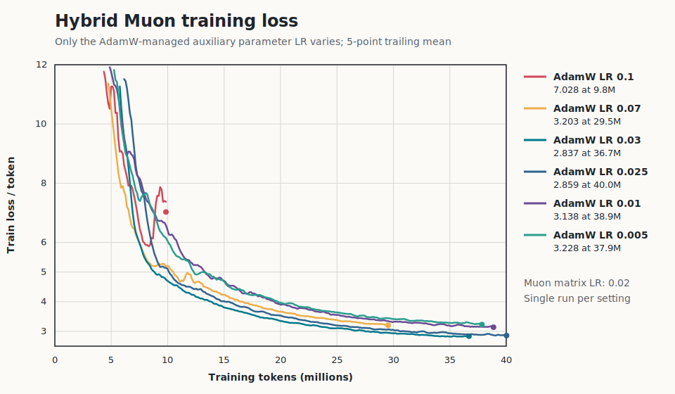
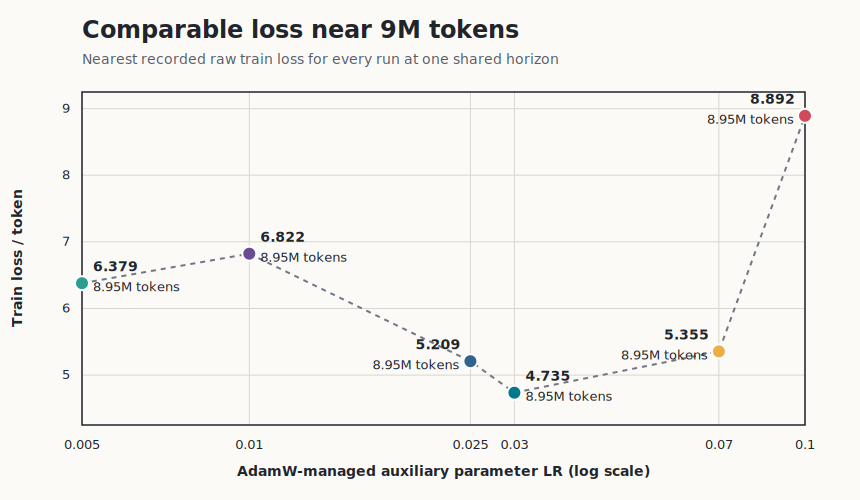
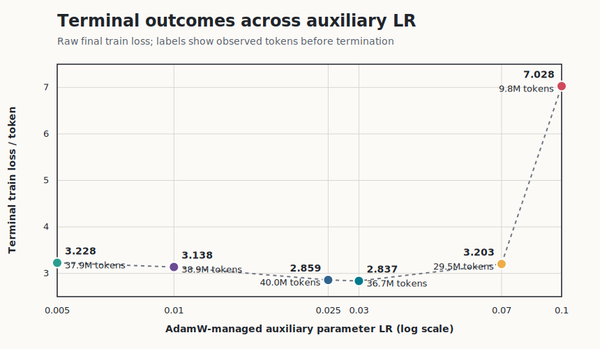

# ScaleTraining Experimental Closeout

## Conclusion

The recovered experiment shows that the learning rate for the parameters
excluded from Muon is a first-order part of the optimizer configuration, not a
minor implementation detail. Across six 2025 TinyStories runs, an auxiliary
AdamW learning rate around `0.025`–`0.03` produced the strongest observed
training-loss trajectory while the Muon matrix learning rate remained fixed at
`0.02`.

At the common 8.95M-token observation, `0.03` had the lowest raw training loss
(`4.735`). It also had the lowest terminal loss (`2.837` at 36.7M tokens), while
`0.025` was effectively adjacent (`2.859`) and was the only run to reach the
full 40M-token budget. The difference between those two settings is too small
to rank without replicated seeds. The defensible result is therefore a useful
operating region, not a claim that `0.03` is universally optimal.

The result is about optimization dynamics on the recorded training stream. It
is not a validation, benchmark, or generalization claim.





## What Was Recovered

The local archive contained 109 W&B run directories and 69 historical
checkpoint files. Before this closeout, none of the checkpoints had validation
sidecars or canonical run reports.

| Classification | Recovered count |
| --- | ---: |
| W&B archives with readable configs | 109 |
| Archives with a history file present (presence only) | 109 |
| Selected histories successfully parsed | 6 |
| Runs with a finite terminal training loss in W&B summary | 70 |
| Historical checkpoint files discovered | 69 |
| Representative checkpoints schema-audited | 3 |
| `tiny-stories-base` project | 83 |
| `fine-web-pretrain` project | 18 |
| `logits_sweep_tinystories` project | 8 |
| TinyStories dataset variant recorded | 83 |
| Five-layer, 512-wide architecture | 85 |
| Six-layer, 512-wide architecture | 1 |
| Seven-layer, 512-wide architecture | 7 |
| 24-layer, 896-wide architecture | 16 |
| Muon matrices + auxiliary AdamW | 90 |
| AdaMuon matrices + auxiliary AdamW | 12 |
| AdamW over all parameters | 7 |
| 1M / 10M / 40M / 80M token budgets | 8 / 55 / 42 / 4 |
| Seed absent from legacy config | 109 |

The complete machine-readable run classification is in
[`data/legacy_run_inventory.json`](data/legacy_run_inventory.json). It retains
run IDs, projects, datasets, architecture, effective optimizer wiring, token
budget, terminal metrics, and the historical Git commit when available.

## Experiment Selection

This family was selected because its six source `model` configs differ in
exactly one recorded field: `lr`. Regeneration compares the source configs and
historical Git commits and fails if any other recorded condition differs.

| Fixed condition | Value |
| --- | --- |
| Dataset | `roneneldan/TinyStories` |
| Tokenizer | `EleutherAI/gpt-neo-125M` |
| Recorded parameters | 41,489,408 |
| Architecture | 5 layers, 8 heads, width 512, hidden width 2048 |
| Token budget | 40M |
| Batch / accumulation | 32 / 4 |
| Attention / residual dropout | 0.2 / 0.2 |
| Schedule | cosine, 1M warmup tokens |
| Muon matrix LR | 0.02 |
| Varied field | `model.lr`: 0.005, 0.01, 0.025, 0.03, 0.07, 0.1 |

The sweep was historically named `muon_lr`, but that name is inaccurate. At
Git commit `8ce307041f0f3c753c860d546775301106b59b0c`, optimizer construction used
`model.muon_lr` for eligible hidden matrices and `model.lr` for embeddings, the
output head, biases, normalization parameters, and other parameters excluded
from Muon. The former stayed at `0.02`; the latter is what changed.

## Results

Every row below comes from the run's binary W&B history, not only its terminal
summary. The common-horizon value is the nearest recorded point to 9M tokens;
all six resolve to the same 8,951,040-token step.

| W&B run | Auxiliary AdamW LR | Loss at 8.95M | Terminal tokens | Terminal loss |
| --- | ---: | ---: | ---: | ---: |
| [`emdbrww3`](https://wandb.ai/thajpo/tiny-stories-base/runs/emdbrww3) | 0.1 | 8.892 | 9.8M | 7.028 |
| [`zrnf1np4`](https://wandb.ai/thajpo/tiny-stories-base/runs/zrnf1np4) | 0.07 | 5.355 | 29.5M | 3.203 |
| [`mxj0pn09`](https://wandb.ai/thajpo/tiny-stories-base/runs/mxj0pn09) | 0.03 | **4.735** | 36.7M | **2.837** |
| [`kh1vl1i7`](https://wandb.ai/thajpo/tiny-stories-base/runs/kh1vl1i7) | 0.025 | 5.209 | 40.0M | 2.859 |
| [`mx3a2a0x`](https://wandb.ai/thajpo/tiny-stories-base/runs/mx3a2a0x) | 0.01 | 6.822 | 38.9M | 3.138 |
| [`31377z9j`](https://wandb.ai/thajpo/tiny-stories-base/runs/31377z9j) | 0.005 | 6.379 | 37.9M | 3.228 |

The training curves support three bounded observations:

- `0.1` was clearly too aggressive in this run family: its loss remained high
  and its history ended after only 24.6% of the configured budget.
- `0.005` and `0.01` learned more slowly and finished above the `0.025`–`0.03`
  region.
- `0.025` and `0.03` form the promising region. Their terminal difference is
  only `0.022`, with no repeated seeds from which to estimate noise.

The unequal terminal-token view is retained as supplementary evidence, not the
primary comparison:



## Checkpoint Compatibility Audit

Three representative checkpoints were audited: high LR (`zrnf1np4`, `0.07`),
the promising region (`kh1vl1i7`, `0.025`), and low LR (`mx3a2a0x`, `0.01`).
All three files:

- deserialize as weights-only `state_dict` payloads,
- match all 54 keys and tensor shapes in the expected legacy dense-model schema,
- have committed SHA-256 identities in
  [`data/checkpoint_compatibility.json`](data/checkpoint_compatibility.json).

Retrospective validation was deliberately not run. The checkpoints have the
historical single shared LayerNorm key layout (`.ln`) while the current model
uses separate attention and MLP LayerNorms (`.ln1` and `.ln2`). The exact
historical validation artifact and dataset revision are also absent. Inventing
a weight-migration rule or evaluating on a newly downloaded dataset snapshot
would create a new experiment, not recover the old one.

## Limitations

- All 109 configs omit the seed. The chosen sweep has one run per setting.
- No validation or benchmark history was preserved for the selected family.
- Five runs ended before the configured token budget, but historical stop
  reasons were not recorded. Terminal-loss comparisons therefore mix horizons.
- The dataset repository and tokenizer name were recorded, but the dataset
  revision and prepared validation artifact were not.
- Historical throughput values are excluded. The legacy timer measured only a
  portion of the update path and cannot support throughput comparisons.
- The three audited checkpoints contain weights only—not optimizer, progress,
  or RNG state—so they do not support exact interruption recovery.

## Reproduction

The committed normalized histories make plot regeneration offline and
credential-free:

```bash
uv run python scripts/plot_legacy_experiment.py
```

Given the original local W&B archives, regenerate both the inventory and the
selected normalized histories:

```bash
uv run python scripts/recover_legacy_runs.py \
  --wandb-dir /path/to/ScaleTraining/wandb
```

Given the original ignored checkpoint directory, repeat the bounded integrity
and compatibility audit:

```bash
uv run python scripts/audit_legacy_checkpoints.py \
  --outputs-root /path/to/ScaleTraining/outputs
```

The parser, SVG renderer, and checkpoint auditor are covered by small committed
fixtures under `tests/fixtures/legacy_runs/`. No new model training was
performed for this closeout.

## Archive Decision

ScaleTraining now has both parts of its intended portfolio story:

1. a reviewer-testable ML reliability harness with explicit artifact and
   evidence contracts; and
2. one recovered, traceable experiment showing why optimizer parameter
   partitioning must be treated as part of the experimental configuration.

Further work should begin only for a new research question. Adding platform
features without such a question would weaken this closeout rather than improve
it.
